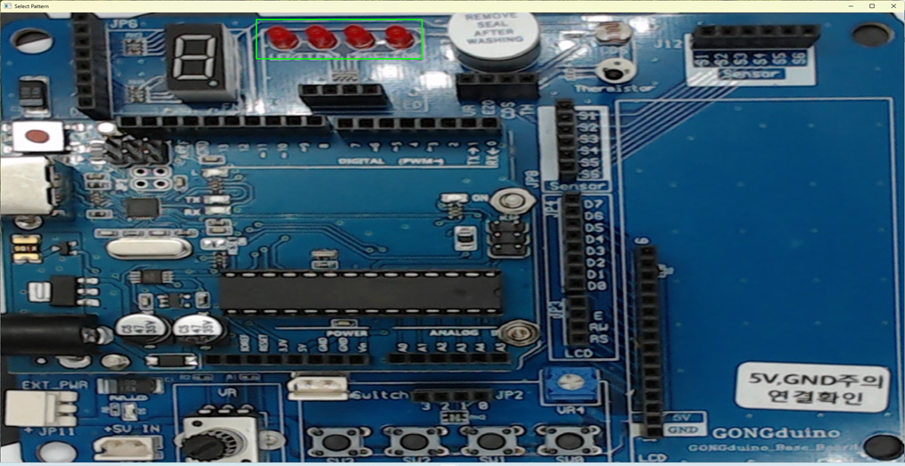

# 머신비전 제품불량 검출기
머신 비전 기술을 활용하여 제품에 발생할 수 있는 시각적 오류를 실시간으로 감지하고 분석하는 통합 솔루션 입니다.

----
# 구성도

1.시작: 프로세스의 시작점입니다.

2.카메라 영역설정 (자동): 카메라가 촬영할 영역을 자동으로 설정하는 단계입니다.

3.카메라 설정: 카메라의 세부 설정을 조정하는 단계입니다.

4.패턴데이터 저장: 인식할 패턴에 대한 데이터를 저장하는 단계입니다.

5.패턴인식: 저장된 데이터를 바탕으로 입력된 이미지에서 패턴을 인식하는 단계입니다.

6.결과출력 저장: 패턴 인식의 결과를 저장하는 단계입니다.

7.종료: 프로세스의 종료점입니다.

---

# 화면구성

------------------

# 1.자동 화면영역 설정

1.그레이스케일 변환

2.가우시안 블러

3.이진화

4.윤곽선 

5.2번째로 큰 사각형 검출 

6.검출된 사각형 수평 회전 

7.빨간색포인트 찾기

8.화면 수직 기준서기준으로 오른쪽이으면 180도 회전 

9.최종 사각형 검출 및 추출
    
10.추출 화면

---------------------------------------
## 2.패턴인식데이터 저장/삭제

---
## 3.패턴매칭 실행

---
## 4.패턴인식데이터 목록

---
## 5.카메라 정밀조작

---
## 6.카메라 프리셋

----
## 7.결과출력 저장

